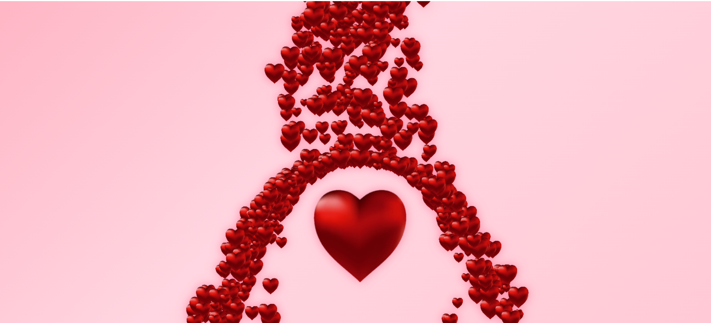

# Falling in Love

**Falling in Love** is an interactive, animated web page featuring a dynamic heart animation and floating text effects, set against a pastel-themed, shifting gradient background. It provides a visually stunning experience with smooth transitions and hover effects.

## Features
- **Interactive Heart Animation:** Hearts follow your cursor on the canvas.
- **Floating Text Animation:** Text floats with a smooth bounce effect.
- **Dynamic Background:** Soft pastel colors with a continuous gradient animation.
- **Mobile Responsive:** Adjusts animations and layout for touch devices.
- **Loading Screen:** Smooth transition effect from a loading screen.

## Preview
Below is a sample screenshot of the project in action:

## How It Works
When the page loads:
1. A loading screen is displayed briefly.
2. The background begins to shift with a pastel-themed gradient animation.
3. Move the cursor to create heart shapes that follow the movement.
4. Hover over the floating text for subtle interaction effects.

## Technologies Used
- **HTML**: Structure of the web page.
- **CSS**: Styling, animations, and responsiveness.
- **JavaScript**: Dynamic interactions and canvas animation logic.

## How to Run
1. Download or clone the project.
2. Open `index.html` in your preferred browser to view it.

## Customization Options
Modify these CSS variables in the `:root` selector to change the theme:
- `--primary-color`: The main color used across animations.
- `--bg-gradient-1`, `--bg-gradient-2`, `--bg-gradient-3`: Adjust the gradient background colors.
- `--text-shadow`: Change the glow and shadow effects for text.

## Contribution
Contributions are welcome! To contribute:
1. Fork the repository.
2. Create a new branch for your feature or bug fix.
3. Commit your changes and submit a pull request.

---

I see you are falling in love with me. ❤️
